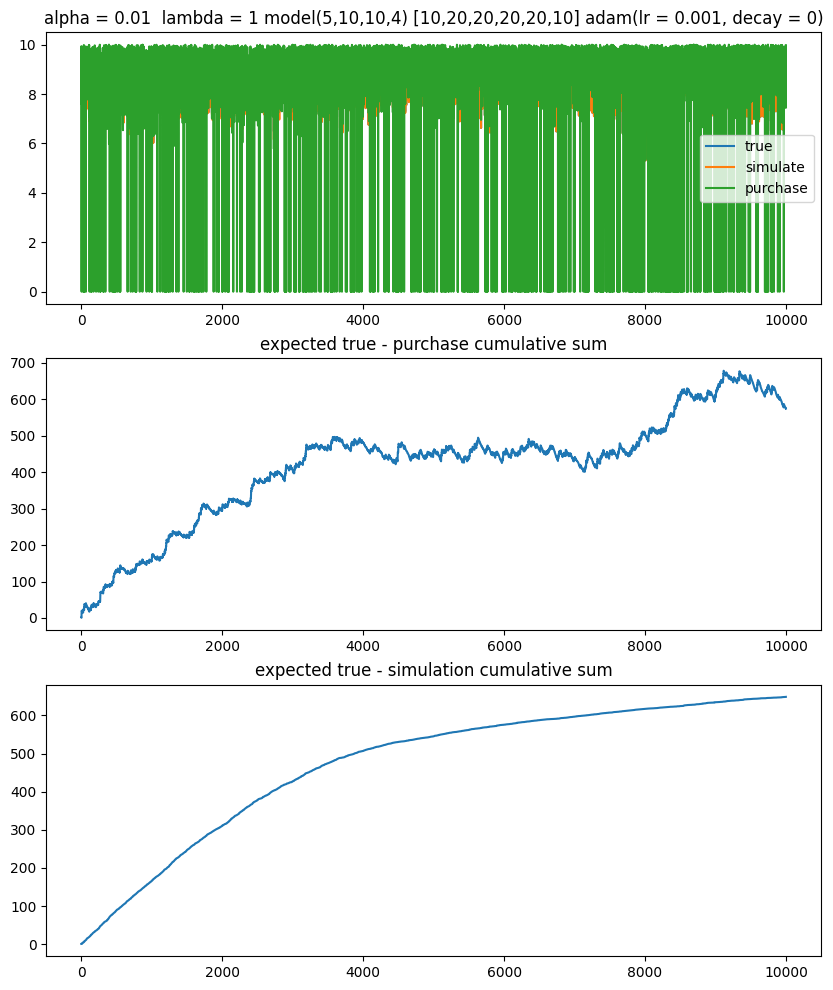
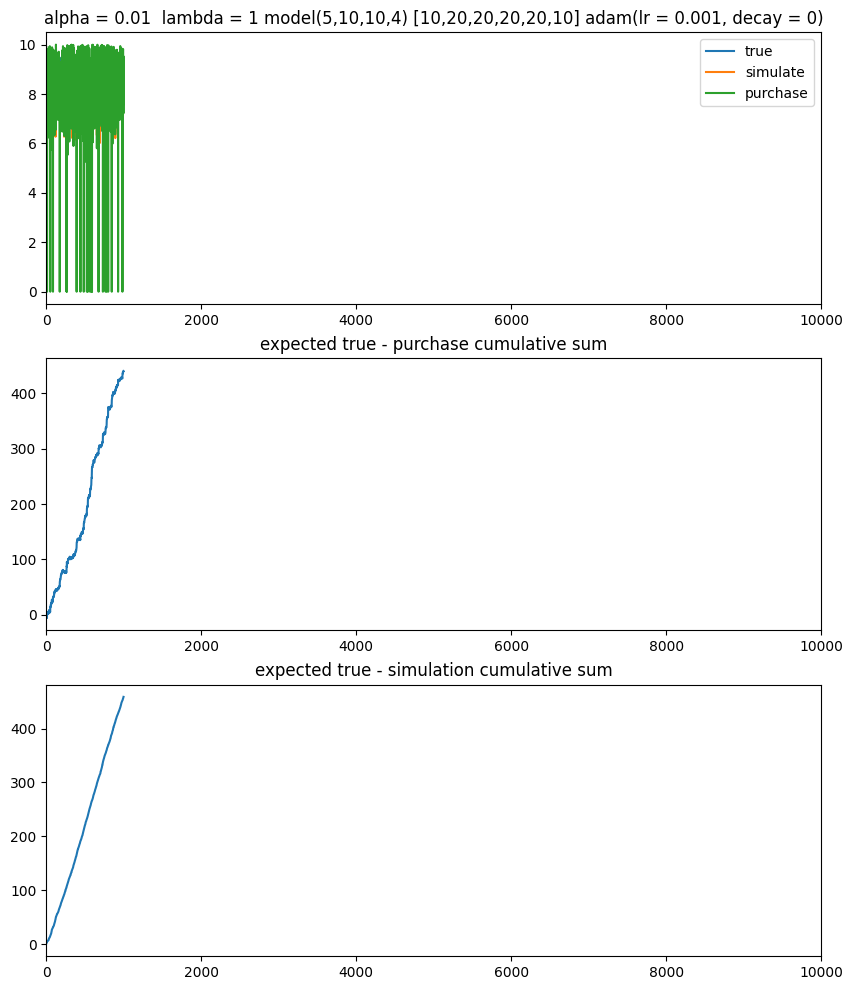
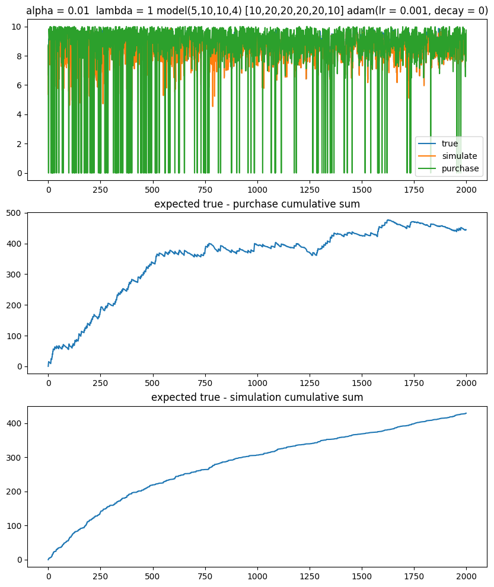

# Neural contextual bandit project  
This is a repo for research purpose of Du Junye in terms of Neural Bandit under assortment settings.  
  
*Supervisor:* Dr. Yang Yu and Mr. Zhang Hongbin

### Algorithm description

### Papers for reference:
1. Neural Contextual bandits with deep representation and shallow exploration
2. Thompson Sampling for Multinomial Logit Contextual Bandit
3. Neural Contextual Bandits with UCB-based exploration 
4. Neural Tangent Kernel: Convergence and Generation in Neural Networks

### *Temporary to-do list:*   
### *Code:*   
- Linear UCB methods     &#10004;
-  Neural UCB methods   &#10004;
-  Neural_LinUCB   &#10004;
-  Neural_linUCB experiment on real-world dataset  &#10004;
-  MLE optimization part   &#10004;
-  Self define neural network loss and backward propogation &#10004;
-  Generating simulation dataset    &#10004;
-  MLE optimization and SGD  &#10004;
-  Integrate into assortment selection  &#10004;
-  Neural_Assort_LinUCB experiment on real-world dataset  &#10004;
-  Generate Non-linear DataSet &#10004;
-  Modify Neural Network and Hperfining &#10004;

### Result figure
### Linear mapping : X @ TRUE _THETA .T 

### Non_linear mapping: Sigmoid(X) @ TRUE_THETA.T

   

### Relu mapping: ReLU(X)@ TRUE_THETA.T

